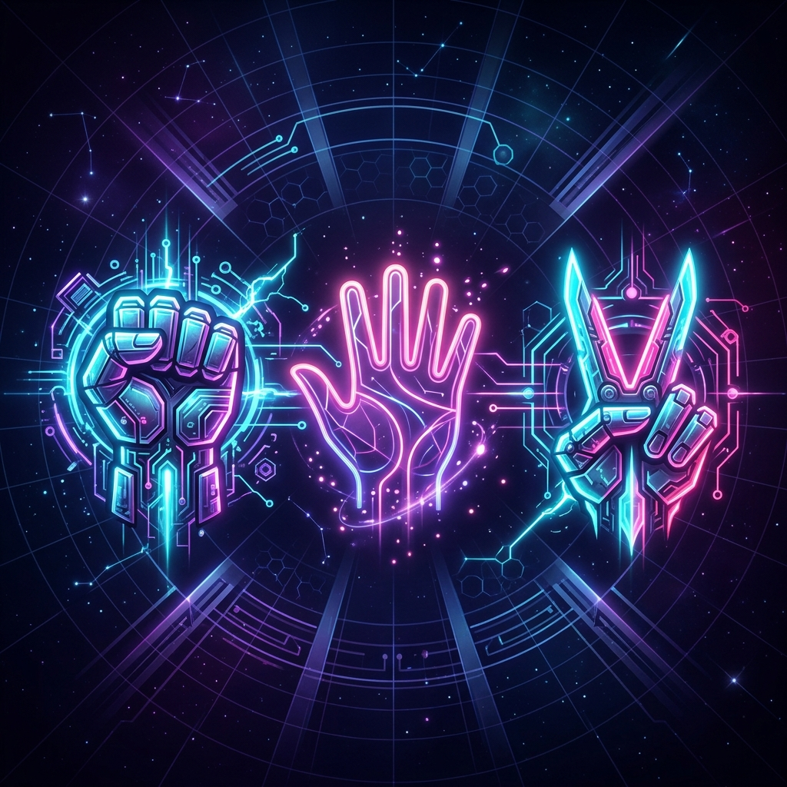

# ⚡ Rock · Paper · Scissors — Ultimate Edition



A high-performance, visually stunning Rock Paper Scissors experience featuring both a **Java Swing "Ultimate Edition"** for desktop and a **Web-based "Lite Edition"** for quick play.

---

## 🎮 Game Editions

### 💎 Ultimate Desktop (Java Swing)
The full experience with multiple game modes and advanced networking.
- **🤖 VS CPU**: Practice against an AI with randomized pattern selection.
- **👥 Local PvP**: Compete with a friend on the same machine.
- **🌐 Online PvP**: Host or join matches over your local Wi-Fi / LAN using TCP sockets.
- **✨ Premium UI**: Neon glow effects, pulse animations, and live round history.

### 🌐 Web Lite (HTML/JS)
A standalone, zero-installation version of the game.
- **Quick Play**: Instant loading in any modern browser.
- **Responsive**: Works on desktop and mobile.
- **Sleek Design**: Maintains the same premium dark-mode aesthetic.

---

## 🚀 How to Run

### 🖥️ Desktop Version (Java)
**Requirements:** Java JDK 17 or later.

1. **Automatic (Windows):**
   - Double-click `compile_and_run.bat`.
   - The script will detect your JDK, compile the source code, and launch the game automatically.
2. **Manual Execution:**
   - Open terminal in the directory.
   - Run: `javac RockPaperScissors.java`
   - Run: `java RockPaperScissors`

#### 🌐 How to Play Online PvP
1. One player clicks **"Host Game"**. They will see an IP and Port (e.g., `192.168.1.5:9876`).
2. Share this code with your friend.
3. The other player clicks **"Join Game"**, enters the code, and clicks **Connect**.

---

### 🌍 Web Version (Browser)
1. Simply open **`index.html`** in any web browser.
2. No installation or setup required!

---

## 📁 File Structure
```text
Rock, Paper, Scisor Game/
├── RockPaperScissors.java   ← Main Java entry point
├── CPUGamePanel.java        ← AI Logic & UI
├── OnlinePanel.java         ← Networking UI
├── GameServer/Client.java   ← TCP Socket Logic
├── index.html               ← Standalone Web version
├── banner.png               ← Project Visual
└── compile_and_run.bat      ← One-click launcher
```

---

## 🎯 Game Rules

| Choice | Beats |
| :--- | :--- |
| 🪨 **Rock** | ✂️ Scissors |
| 📄 **Paper** | 🪨 Rock |
| ✂️ **Scissors** | 📄 Paper |

---

*Built with ❤️ by Amar Kumar Mandal copyright 2026*
